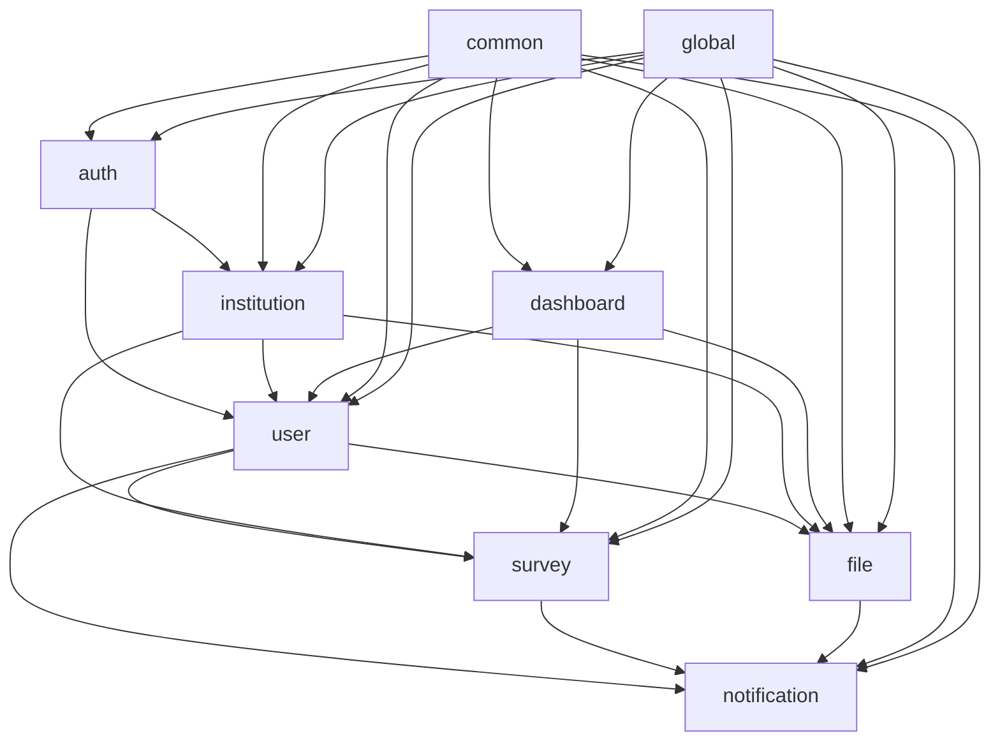

# 프로젝트 구조 가이드

## 📁 도메인별 패키지 구조

```
src/main/kotlin/com/onsae/api/
├── auth/                    # 인증/인가
│   ├── controller/
│   ├── service/
│   ├── dto/
│   ├── exception/
│   └── README.md
├── user/                    # 사용자 관리
│   ├── controller/
│   ├── service/
│   ├── repository/
│   ├── entity/
│   ├── dto/
│   ├── exception/
│   └── README.md
├── institution/             # 기관 관리
│   ├── controller/
│   ├── service/
│   ├── repository/
│   ├── entity/
│   ├── dto/
│   ├── exception/
│   └── README.md
├── survey/                  # 설문/질문/템플릿
│   ├── controller/
│   ├── service/
│   ├── repository/
│   ├── entity/
│   ├── dto/
│   ├── exception/
│   └── README.md
├── file/                    # 파일 업로드
│   ├── controller/
│   ├── service/
│   ├── repository/
│   ├── entity/
│   ├── dto/
│   ├── exception/
│   └── README.md
├── notification/            # 알림
│   ├── controller/
│   ├── service/
│   ├── dto/
│   ├── exception/
│   └── README.md
├── dashboard/               # 대시보드/통계
│   ├── controller/
│   ├── service/
│   ├── dto/
│   ├── exception/
│   └── README.md
├── common/                  # 공통
│   ├── entity/
│   ├── exception/
│   ├── dto/
│   └── MultiTenantUtils.kt
├── global/                  # 전역 처리
│   ├── exception/
│   └── README.md
└── config/                  # 설정
```

## 🏗️ 도메인별 책임

### 1. **auth** - 인증/인가
- 로그인 (SystemAdmin, Admin, User)
- JWT 토큰 생성/검증/갱신
- 권한 검증

### 2. **user** - 사용자 관리
- **SystemAdmin**: 시스템 관리자
- **Admin**: 기관 관리자 (승인/거부)
- **User**: 복지관 이용자
- **UserGroup**: 사용자 그룹

### 3. **institution** - 기관 관리
- **Institution**: 복지관 정보
- 기관별 설정 관리
- 멀티테넌시 관련

### 4. **survey** - 설문/질문/템플릿
- **Category**: 질문 카테고리
- **Question**: 질문 생성/관리
- **Assignment**: 질문 할당
- **Response**: 응답 수집
- **Template**: 질문 템플릿

### 5. **file** - 파일 업로드
- **Upload**: 업로드 요청
- **UploadFile**: 파일 정보
- 파일 처리 (썸네일, 메타데이터)
- 관리자 응답

### 6. **notification** - 알림
- FCM 푸시 알림
- 알림 이력 관리
- 알림 템플릿

### 7. **dashboard** - 대시보드/통계
- 응답률 통계
- 사용자 현황
- 미확인 업로드 알림
- 리포트 생성

### 8. **common** - 공통
- **BaseEntity**: 공통 엔티티
- **BusinessException**: 공통 예외
- **MultiTenantUtils**: 멀티테넌시 유틸
- 공통 DTO

### 9. **global** - 전역 처리
- **GlobalExceptionHandler**: 전역 예외 처리
- **ErrorResponse**: 에러 응답 DTO
- API 응답 표준화
- 전역 로깅 및 모니터링

## 🔗 도메인 간 관계



## 📋 개발 규칙

### 1. **패키지 구조**
- 각 도메인은 독립적인 패키지 구조 유지
- `controller`, `service`, `repository`, `entity`, `dto`, `exception` 하위 패키지
- 도메인 간 직접 의존성 최소화

### 2. **예외 처리**
- 각 도메인별 특화된 예외 클래스 생성
- `common.exception.BusinessException` 상속
- `GlobalExceptionHandler`에서 일괄 처리

### 3. **멀티테넌시**
- 모든 Entity에 `institution_id` 필드
- `common.MultiTenantUtils`로 접근 제어
- Repository에서 자동 필터링

### 4. **API 설계**
```
/api/auth/**           # 인증 관련
/api/system/**         # 시스템 관리자 전용
/api/admin/**          # 기관 관리자 전용
/api/user/**           # 복지관 이용자 전용
```

### 5. **Entity 관계**
- 도메인 간 Entity 참조는 ID로만 관리
- 복잡한 조인은 Service 레이어에서 처리
- 양방향 관계는 필요시에만 사용

## 🚀 다음 개발 단계

1. **Repository 계층**: 각 도메인별 JPA Repository
2. **Service 계층**: 비즈니스 로직 구현
3. **Controller 계층**: REST API 엔드포인트
4. **DTO 설계**: 요청/응답 객체
5. **보안 구현**: JWT 인증, 권한 검증
6. **테스트 작성**: 단위/통합 테스트